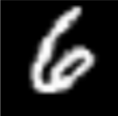

# DL workshop 2 -  Part 2

***

相信大家已经在workshop1中初步体验过 **卷积神经网络** 的搭建过程,下面我们来具体介绍一下卷积神经网络(convolutional neural networks，CNN)。

## 1. 全连接的局限性

多层感知机（MLP）采用全连接，可以通过多个表示线性关系隐藏层来拟合数据之间非线性关系，适合于**寻找数据间的关系**。但当我们使用MLP来进行图像识别，对于百万级像素的图片，即使隐藏层只用1000个神经元，整个MLP会产生上亿个参数。

## 2. CNN的优良特性

下面我们以这个找出大熊猫的游戏来介绍CNN适用于处理图像数据的一些优良特性。

### 2.1 平移不变性

想要用CNN在这张图片中找到大熊猫，我们需要做到无论大熊猫藏在哪一个位置，CNN都能够通过判断大熊猫的特征，并把它从图像中找出来，这就是**平移不变性**。

平移不变性在CNN中具体体现为: 不管检测对象出现在图像中的哪个位置，神经网络的前面几层对相同的图像区域具有相似的反应。

### 2.2 局部性

为了找出大熊猫，比较有效的方式是把图片分割成许多个区域，并给这些区域出现大熊猫的概率打分。这就意味着每个神经元只负责图片中的一小部分，而不会过多考虑图片整体关联。

局部性在CNN中具体体现为：神经网络的前面几层应该只探索输入图像中的局部区域，而不过度在意图像中相隔较远区域的关系。

**Note:** 详细数学证明请看《动手学深度学习》237-238

以上两个特性让MLP上亿个参数减少到几百个，但也限定我们学习的特征**只能是平移不变**的。

## 3. CNN的内部结构

CNN的主要结构有**卷积层**、**汇聚层**、**全连接层**，下面我们主要来讲讲卷积层和汇聚层。

## 3.1 卷积层

卷积层对输入和卷积核进行**互相关运算**，并在添加标量偏置之后产生输出。所以，卷积层中的两个被训练的参数是**卷积核权重**和**标量偏置**。

### 3.1.1 卷积运算与互相关运算

**卷积运算：**

它的意义是：把g关于y轴翻转，向右平移x后形成一个新函数，并计算它与f乘积的积分。

**对于二维数组:**

这里i,j,a,b都是的数组的索引。相比于上面，这里对g翻转时g的两个索引都会取负值。

**互相关运算：**

**对于二维向量：**

互相关运算与卷积运算的差别在于**卷积运算需要对g先进行翻转操作**再与f进行运算

举个互相关运算的例子：

核函数从输入函数的左上角开始，**从上到下、从左到右**地在输入函数内滑动，并通过互相关运算得到输出。

而卷积运算就是把核函数先上下、左右翻转后再进行上面的运算。

我们把上面例子中的核函数叫做**卷积核**，也可以叫做**滤波器**，卷积核里的数字叫做**卷积核权重**。

由于在训练神经网络时，卷积核权重是在不断调整的，因此，我们可以在卷积层中用较为简单的互相关运算代替卷积运算。

### 3.1.2 填充和步幅

在上面的例子中，假设输入形状为a×b，卷积核形状为c×d，那么输出形状将是$(a−c+1)×(b−d+1)$。可以看出，输出形状取决于输入形状和卷积核的形状。还有什么因素会影响输出的大小呢？下面我们将介绍**填充**（padding）和**步幅**（stride）。

#### 填充

在应用多层卷积时，我们常常丢失边缘数据。由于我们通常使用小卷积核，因此对于单个卷积，我们可能只会丢失几个数据。但随着我们应用许多连续卷积层，累积丢失的数据就多了。解决这个问题的简单方法即为**填充**：在输入图像的边界填充元素（通常填充元素是0）。

如果我们添加h行填充（大约一半在顶部，一半在底部）和w列填充（左侧大约一半，右侧一半），则输出形状将为$(a−c+h+1)×(b−d+w+1)$。

举个例子：

#### 步幅

在进行互相关运算的时候，有时候为了高效计算或是缩减采样次数，卷积核可以每次滑动多个元素。我们将每次滑动元素的数量称为步幅（stride）。

如果我们选取垂直步幅为p、水平步幅为q，输出形状为：$⌊(a-c+h+p)/p ⌋ × ⌊(b − d + w + q)/q ⌋$。

举个例子：

### 3.1.3 通道

在神经网络中，通道一般分为**输入通道** (in_channels) 和**输出通道** (out_channels)。

输入数据的通道数 in_channels, 取决于**图片的类型**。如果图片是彩色的，即RGB类型，这时候通道数固定为3；如果是灰色的，通道数为1。

完成卷积之后，输出的通道数 out_channels 取决于卷积层中**卷积核的数量**。这里的 out_channels 等于卷积核的数目，一个通道对应一个卷积核。可以理解为：**每一个输出通道都表示了图像某一方面的信息**。

对于第二层或者更多层的卷积，当前层的 in_channels 就是上一层的out_channels ， 当前层的out_channels 还是取决于当前层的卷积核数目。

举个例子：

## 3.2 汇聚层

我们的机器学习任务通常会跟全局图像的问题有关（例如数字识别），所以我们最后一层的神经元应该对整个输入的全局敏感。神经网络通过逐渐聚合信息，生成越来越粗糙的映射，最终实现**学习粗糙的全局表示**的目标。

  

我们要介绍的汇聚（pooling）层有两个目的：降低卷积层对位置的敏感性，同时降低在信息提取中丢失的信息对输出的影响。

### 3.2.1 最大汇聚层和平均汇聚层

与卷积层类似，汇聚层由一个固定形状的“窗口”组成。该“窗口”根据步幅大小，从输入数据左上角开始，从上到下、从左到右滑动。然而，不同于卷积层，汇聚层**不包含参数**。也就是说，汇聚层的运算是确定的。我们通常计算汇聚“窗口”中所有元素的最大值或平均值。我们把进行这样操作的汇聚层称为**最大汇聚层**（maximum pooling）和**平均汇聚层**（average pooling）。

举个例子：

与卷积层不同的是，**卷积层的输出通道数取决于卷积层的卷积核数量，而汇聚层的输出通道数等于输入通道数**。

### 总结

关于如何把卷积层、汇聚层、全连接层连接在一起，我们将在Part3详细讲解。
